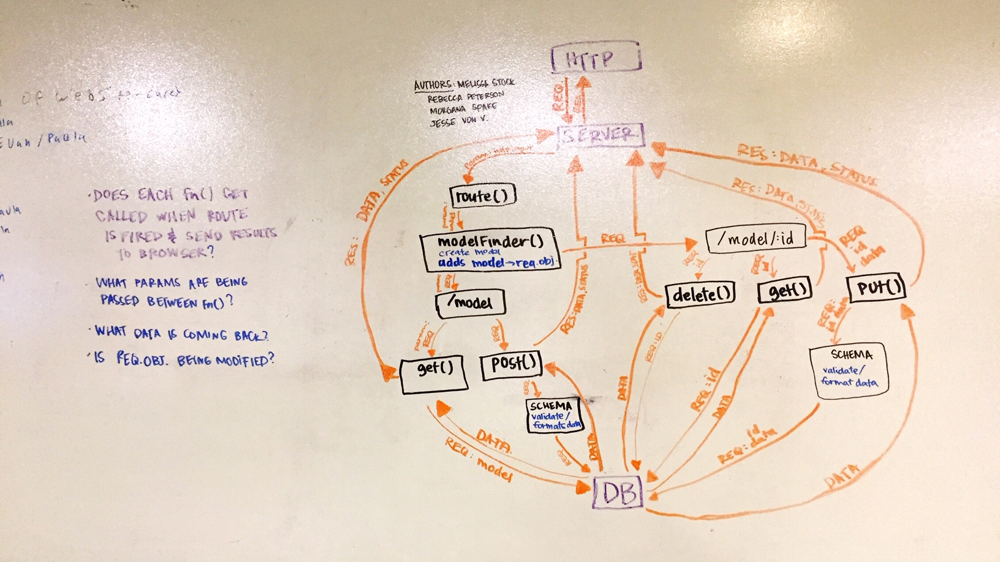

 LAB
=================================================

## API server

### Author: Melissa Stock

### Links and Resources
* [submission PR](https://github.com/401-advancedjs/api-server/pull/1)
* [travis](https://www.travis-ci.com/)

#### Documentation
* [jwt docs](https://www.npmjs.com/package/jsonwebtoken)
* [mongo docs](https://mongoosejs.com/docs/guide.html)
* [httpie docs](https://httpie.org/doc)

### Modules
#### `handleDelete.js`
#### `handleGetAll.js`
#### `handleGetOne.js`
#### `handlePost.js`
#### `handlePut.js`
#### `v1.js`
#### `role-model.js`
#### `users-model.js`
#### `acl-router.js`
#### `middleware.js`
#### `router.js`
#### `404.js`
#### `error.js`
#### `model-finder.js`
#### `categories-model.js`
#### `players-model.js`
#### `players-schema.js`
#### `teams-model.js`
#### `teams-schema.js`
#### `memory-model.js`
#### `mongo-model.js`
#### `app.js`

##### Exported Values and Methods

###### `_authBasic(authString) -> object`
###### `_authBearer(authString) -> object`

### Setup
#### `.env` requirements
* `PORT` - Port Number
* `MONGODB_URI` - URL to the running mongo instance/db
* `SECRET` - Used to decode information in db

#### Running the app
* `npm start`
* Endpoint: `/signup`
  * Returns a JSON object with new user in it.
* Endpoint: `/signin`
  * Returns a JSON object with user data in it.
* Endpoint: `/key`
  * Return a JSON object with user data in it.
* Endpoint: `/api/v1/:model`
  * Return a JSON object with data from all things within the model.
* Endpoint: `/api/v1/:model/:id`
  * Return a JSON object with data about specific model and id selected.
* Endpoint: `/public-stuff`
  Return a string 'from public stuff'.
* Endpoint: `/hidden-stuff`
  Return a string 'from hidden stuff'.
* Endpoint: `/something-to-read`
  Return a string 'from something to read'.
* Endpoint: `/create-a-thing`
  Return a string 'from create a thing'.
* Endpoint: `/update`
  Return a string 'from update'.
* Endpoint: `/jp`
  Return a string 'from jp'.
* Endpoint: `/bye-bye`
  Return a string 'from bye bye'.
* Endpoint: `/everything`
  Return a string 'from everything'.
  
#### Tests
* How do you run tests? `npm run test`
* What assertions were made?
  * auth middleware verifies that users and admins can log in
  * auth middleware allows users to sign in with basic and bearer tokens
  * expired tokens do not allow a user to login
  * tokens expire in 15min
  * Auth Keys do not expire
  * Auth keys can login a user as a token would
  * single use tokens are not regenerated
  * auth middleware grants access to create/delete/read/update to the authorized 
  users
  * Model finder middleware
* What assertions need to be / should be made?
  * Assertions on the data shape returned from the API routes
  * Assertions on the OAuth chooser

#### UML
<!--  -->

